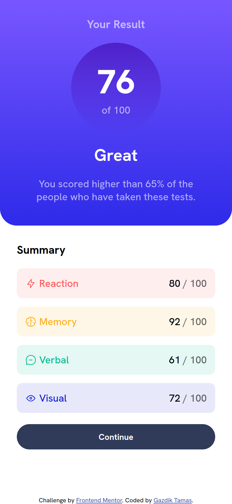

# Frontend Mentor - Results summary component solution

This is a solution to the [Results summary component challenge on Frontend Mentor](https://www.frontendmentor.io/challenges/results-summary-component-CE_K6s0maV). Frontend Mentor challenges help you improve your coding skills by building realistic projects. 

## Table of contents

- [Overview](#overview)
  - [The challenge](#the-challenge)
  - [Screenshot](#screenshot)
  - [Links](#links)
- [My process](#my-process)
  - [Built with](#built-with)
  - [What I learned](#what-i-learned)
  - [Continued development](#continued-development)
  - [Useful resources](#useful-resources)
- [Author](#author)
- [Acknowledgments](#acknowledgments)


## Overview

### The challenge

Users should be able to:

- View the optimal layout for the interface depending on their device's screen size
- See hover and focus states for all interactive elements on the page

### Screenshot




### Links

- Solution URL: [GitHub Repository](https://github.com/tamasgazdik/results-summary-component-main)
- Live Site URL: [Frontend Mentor | Results summary component](https://results-summary-component-main.tamasgazdik.vercel.app/)

## My process

### Built with

- Semantic HTML5 markup
- CSS custom properties
- CSS Grid
- Flexbox
- Mobile-first workflow


### What I learned

Use this section to recap over some of your major learnings while working through this project. Writing these out and providing code samples of areas you want to highlight is a great way to reinforce your own knowledge.

One of the most important things I've learned while creating this project regarding the HTML document is using semantic markup. I probably didn't get everything right for the first time (any feedback in this regard to the HTML written is greatly appreciated!), still I feel like using elements such as ```<main>```, ```<footer>```,  ```<article>``` and ```<section>```, and utilizing the ```aria-label``` or ```aria-labelledby``` attributes greatly improve the accessibility of the content compared to only using ```<div>``` tags, which in general has no semantic meaning whatsoever.

Regarding CSS I've learned a lot since building [my first challenge on Frontend mentor](https://qr-code-component-main.tamasgazdik.vercel.app/), including CSS Grid, the use of variables, utility classes, global style best practices, and resets. I wouldn't go into the details of them, but I'd like to mention that grid helped a ton with creating the basic layout for the site. Another thing I'd note is the use of ```:focus-visible``` pseudo class instead of ```:focus``` on my ```<button>```, the former being applied in a more heuristic way by browsers, which I find very interesting.

```css
button:hover,
button:focus-visible {
    background-image: linear-gradient(var(--light-slate-blue),
            var(--light-royal-blue));
    cursor: pointer;
}
```


### Continued development

Use this section to outline areas that you want to continue focusing on in future projects. These could be concepts you're still not completely comfortable with or techniques you found useful that you want to refine and perfect.

Regarding my HTML writing skills I'd like to continue using semantic elements as much as possible, and also improve the accessibility of what I build in the future.

When it comes to CSS, there are a lot of things which I still need to learn. I just started experimenting with CSS Grid so there's a lot of room for improvement in that regard. Creating responsive layouts is also a weakness of mine, so I'll spend some time with that in the following days.

Practice makes perfect (or at least better), so there's nothing to it, but to do it! :)


### Useful resources

I cannot pass this section without linking the channels on YouTube which help me immensely on my frontend development journey:
- [Slaying The Dragon](https://www.youtube.com/@slayingthedragon) - Ramzi creates amazing tutorial videos on certain CSS tools and concepts, such as Flexbox, Grid, animations, etc. without any nonsense.
- [Kevin Powell](https://www.youtube.com/@KevinPowell) - Kevin provides regular CSS tips & tricks which give answers to both common and niche problems. His videos enlightened a bunch of CSS concepts for me.
- [A11ycasts with Rob Dodson](https://www.youtube.com/playlist?list=PLNYkxOF6rcICWx0C9LVWWVqvHlYJyqw7g) - Rob does a wonderful job introducing people into several accessibility concepts as part of this playlist. If you care about a11y, definitely take a look!


## Author

- Website - [Gazdik Tamas](https://tamasgazdik.github.io/)
- Frontend Mentor - [@tamasgazdik](https://www.frontendmentor.io/profile/tamasgazdik)
- Twitter - [@GazdikTamas](https://twitter.com/GazdikTamas)


## Acknowledgments

First of all I'd like to give thanks to [Frontend Mentor](https://www.frontendmentor.io/) for providing the possibility to complete frontend development challenges. I really like that they provide the style guide and all the assets to be used, so one can really focus on building.

Hats off to all YouTube content creators that I mentioned before. Regarding this challenge Kevin has [a great video](https://youtu.be/KqFAs5d3Yl8) in which he completes the challenge itself and walks you through his thought process and why he does certain things. I took inspiration and some ides from that video.